<!-- GitHub Profile README for Bhargab Jyoti Bhuyan — terminal layout (heatmap + neofetch) -->

<div align="center">

<h3><code>bjb0@github ~ $ ./contributions.sh</code></h3>



<br><br>

<h3><code>bjb0@github ~ $ whoami</code></h3>

<table>
<tr>
<td valign="top"></td>
<td valign="top"></td>
</tr>
</table>

<br>

<p align="center">
  
</p>

<h3><code>bjb0@github ~ $ ./links.sh</code></h3>

<p align="left">
  <a href="https://www.linkedin.com/in/bhargab-jb/" title="LinkedIn"></a>
  <a href="mailto:bjbcr7@gmail.com" title="Email"></a>
  <a href="https://www.instagram.com/bhargab_jb/" title="Instagram"></a>
</p>

</div>

---

## Tech

<p align="left">
  
</p>

**LLMs & NLP:** Dense retrieval · RAG · LangChain · LangGraph · scikit-learn · prompt design · Gemini / OpenAI / Anthropic APIs

**Also use:** Pydantic · MLflow · DVC · vector stores (learning advanced retrieval & reranking).

---

## Contribution snake

<p align="center">
  <picture>
    <source media="(prefers-color-scheme: dark)" srcset="https://raw.githubusercontent.com/BJB0/BJB0/output/github-snake-dark.svg?palette=github-dark" />
    <source media="(prefers-color-scheme: light)" srcset="https://raw.githubusercontent.com/BJB0/BJB0/output/github-snake.svg?palette=rainbow" />
    
  </picture>
</p>

---

*Fun fact: I lift heavier than my code compiles.*

### Replace the ASCII placeholder with your photo

The left panel is generated initials art (`profile-ascii.svg`). For a photo portrait like the [terminal README pattern](https://github.com/AVIVASHISHTA29/AVIVASHISHTA29):

```bash
pip install -r scripts/requirements.txt
python scripts/prep_photo.py path/to/your-photo.png
python scripts/make_ascii_svg.py   # writes profile-ascii.svg
```

Commit the updated `profile-ascii.svg` (and optionally remove `make_initials_ascii_svg.py` from your local workflow).
